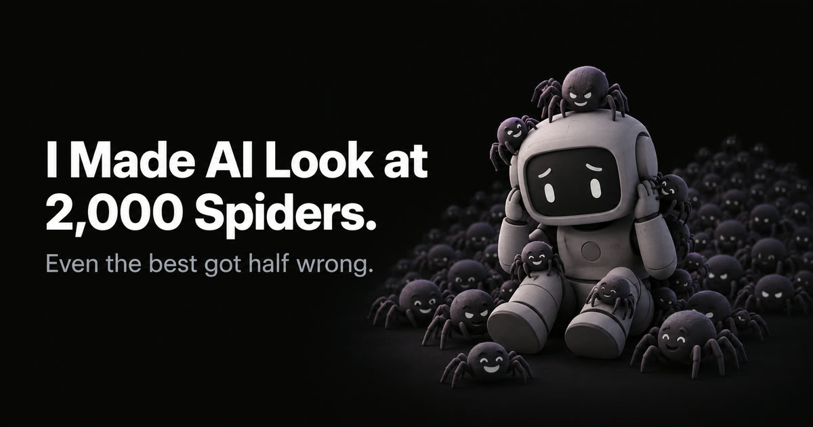
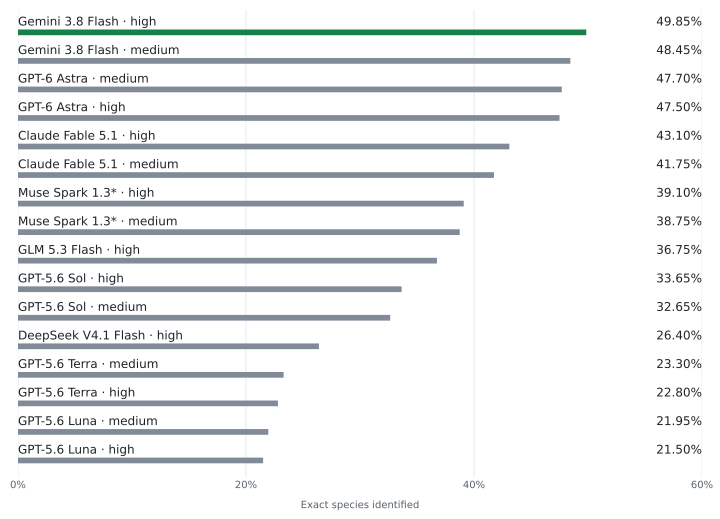
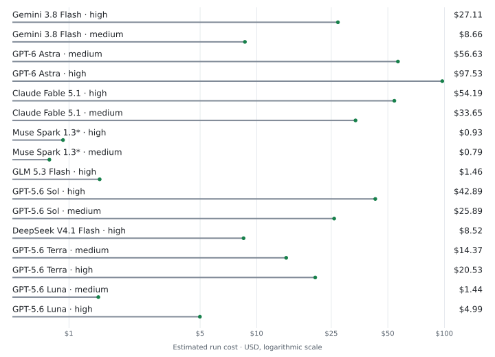
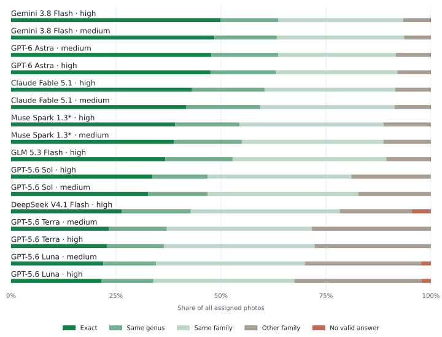

[](https://kielbasa.dev/blog/how-well-can-ai-identify-spiders)

# Spider Bench

**2,000 photos · 671 species and subspecies**

How well can AI tell spiders apart? This repository contains the frozen tasks, model answers, scores, and Python CLI behind the experiment. Every model sees the same photos and the same 20 possible names. The best run got **49.85%** right.

[Read the story](https://kielbasa.dev/blog/how-well-can-ai-identify-spiders) · [Run it yourself](src/spider_bench/README.md) · [Full leaderboard](data/benchmarks/leaderboard.md) · [Benchmark protocol](docs/benchmark-v5.md)

## Who knew the spiders?

<picture>
  <source media="(max-width: 600px) and (prefers-color-scheme: dark)" srcset="docs/assets/readme/accuracy-dark-mobile.svg">
  <source media="(max-width: 600px)" srcset="docs/assets/readme/accuracy-light-mobile.svg">
  <source media="(prefers-color-scheme: dark)" srcset="docs/assets/readme/accuracy-dark.svg">
  
</picture>

Accuracy is **correct species / 2,000 photos**. Failed and missing answers count as incorrect.

<details>
<summary>Every score, cost, and run file</summary>

<!-- results:start -->
| Model | Effort | Accuracy | Correct / 2,000 | Failures | Est. USD | Evidence |
| :--- | :--- | ---: | ---: | ---: | ---: | :--- |
| Gemini 3.8 Flash | high | 49.85% | 997 | 4 | $27.11 | [Run](data/benchmarks/runs/gemini-20260910-230024) |
| Gemini 3.8 Flash | medium | 48.45% | 969 | 0 | $8.66 | [Run](data/benchmarks/runs/gemini-20260910-224151) |
| GPT-6 Astra | medium | 47.70% | 954 | 3 | $56.63 | [Run](data/benchmarks/runs/astra-20260911-094235) |
| GPT-6 Astra | high | 47.50% | 950 | 4 | $97.53 | [Run](data/benchmarks/runs/astra-20260911-151008) |
| Claude Fable 5.1 | high | 43.10% | 862 | 2 | $54.19 | [Run](data/benchmarks/runs/fable-20260910-212610) |
| Claude Fable 5.1 | medium | 41.75% | 835 | 3 | $33.65 | [Run](data/benchmarks/runs/fable-20260910-203000) |
| Muse Spark 1.3\* | high | 39.10% | 782 | 0 | $0.93 | [Run](data/benchmarks/runs/muse-20260911-093228) |
| Muse Spark 1.3\* | medium | 38.75% | 775 | 0 | $0.79 | [Run](data/benchmarks/runs/muse-20260911-013451) |
| GLM 5.3 Flash | high | 36.75% | 735 | 3 | $1.46 | [Run](data/benchmarks/runs/glm-20260911-153101) |
| GPT-5.6 Sol | high | 33.65% | 673 | 1 | $42.89 | [Run](data/benchmarks/runs/sol-20260910-235122) |
| GPT-5.6 Sol | medium | 32.65% | 653 | 1 | $25.89 | [Run](data/benchmarks/runs/sol-20260910-230417) |
| DeepSeek V4.1 Flash | high | 26.40% | 528 | 92 | $8.52 | [Run](data/benchmarks/runs/deepseek-20260910-225059) |
| GPT-5.6 Terra | medium | 23.30% | 466 | 0 | $14.37 | [Run](data/benchmarks/runs/terra-20260910-212630) |
| GPT-5.6 Terra | high | 22.80% | 456 | 0 | $20.53 | [Run](data/benchmarks/runs/terra-20260910-220616) |
| GPT-5.6 Luna | medium | 21.95% | 439 | 48 | $1.44 | [Run](data/benchmarks/runs/luna-20260910-202928) |
| GPT-5.6 Luna | high | 21.50% | 430 | 45 | $4.99 | [Run](data/benchmarks/runs/luna-20260910-190742) |
<!-- results:end -->

</details>

## What did those answers cost?

Estimated cost per 2,000-photo run: **$0.79–$97.53**. The dollar axis is logarithmic.

<picture>
  <source media="(max-width: 600px) and (prefers-color-scheme: dark)" srcset="docs/assets/readme/cost-dark-mobile.svg">
  <source media="(max-width: 600px)" srcset="docs/assets/readme/cost-light-mobile.svg">
  <source media="(prefers-color-scheme: dark)" srcset="docs/assets/readme/cost-dark.svg">
  
</picture>

*Muse Spark 1.3 uses discounted Contributor pricing, with provider training and data use enabled.*

## How wrong is wrong?

Each bar covers all 2,000 photos. “Same family” excludes same-genus answers; “No valid answer” includes failed and missing responses.

<picture>
  <source media="(max-width: 600px) and (prefers-color-scheme: dark)" srcset="docs/assets/readme/mistakes-dark-mobile.svg">
  <source media="(max-width: 600px)" srcset="docs/assets/readme/mistakes-light-mobile.svg">
  <source media="(prefers-color-scheme: dark)" srcset="docs/assets/readme/mistakes-dark.svg">
  
</picture>

[Download the numeric chart data](docs/assets/readme/results.json).

## Run it yourself

Python **3.12+**.

```bash
git clone https://github.com/qforge-dev/spider-bench.git
cd spider-bench
python3 -m venv .venv
source .venv/bin/activate
pip install -e .
spider-bench benchmark models
```

[Provider setup and pilot run](src/spider_bench/README.md#start-with-a-pilot) · [Reproduce the 2,000-photo comparison](src/spider_bench/README.md#reproduce-the-published-2000-photo-setup) · [CLI guide](src/spider_bench/README.md)

---

<details>
<summary>A spider escaped. Call security.</summary>

Fortunately, we have a specialist for this.

<picture>
  <source media="(prefers-reduced-motion: reduce)" srcset="docs/assets/readme/cat-patrol-still.png">
  
</picture>

Species identification: inconclusive. Spider removal: enthusiastic.

</details>

Code: [MIT](LICENSE). Photos: [individual licenses and attribution](docs/licensing.md).
